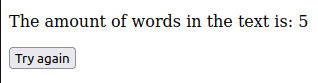

# Voxy Challenge

## Word Count App

This application counts words in a text. It's assumes the premise that all the words must be separated by whitespace. The processing removes all numbers and special characters. Only regex r'[a-zA-Z]+' groups of characters separated by whitespace are considered a word. Here's an example:
 
 

 
 

 
 

### TODO List:
 

1. Install pre-commit hooks
2. Dockerize the application
3. Implement test cases with pytest
4. Better looking user interface using React and MaterialUI

5. Implement a better description of the error when the text input is only whitespaces:

 

### Install the project

1. Create a virtual environment 
`python3 -m venv env`

2. Activate the virtual environment 
`source env/bin/activate`

3. Install the requirements 
`pip install -r requirements.txt`

4. Go to the project folder and run the server 
`cd project/`\
`python manage.py runserver`

5. Access http://127.0.0.1:8000/words_app/ on your browser
